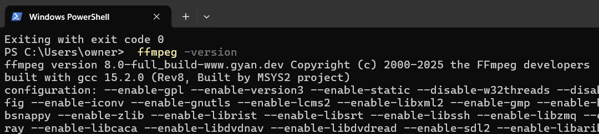
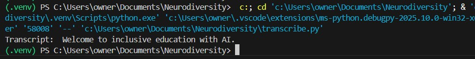
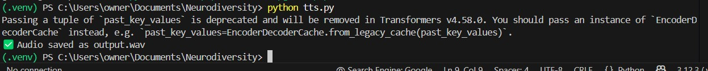
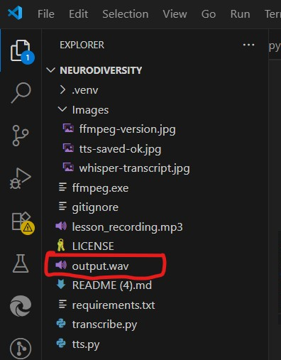

# Inclusive AI Toolkit

Inclusive AI Toolkit is a lightweight Python project that demonstrates how to
build accessible speech utilities with entirely local resources. It combines
OpenAI Whisper for speech-to-text (STT) and Hugging Face SpeechT5 for
text-to-speech (TTS) so educators can prototype inclusive learning experiences
without depending on proprietary cloud services.

## Features

- **Local transcription**: Run Whisper locally to transcribe lessons, meetings,
  or announcements without uploading audio to the cloud.
- **Speech synthesis**: Convert text into natural-sounding speech using the
  SpeechT5 model and a deterministic speaker embedding.
- **Extensible scripts**: Reusable helper functions make it easy to integrate
  transcription and synthesis into other Python applications.
- **Optional cloud integration**: The repository documents how to call the
  OpenAI Whisper API for scenarios where managed infrastructure is preferred.

## Repository Structure

```text
.
├── Images/                  # Optional screenshots for documentation
├── lesson_recording.mp3     # Sample audio used during walkthroughs (not tracked)
├── notes.txt                # Project summary generated by scripts/generate_notes.py
├── requirements.txt         # Python dependencies for Whisper and SpeechT5
├── scripts/
│   └── generate_notes.py    # Helper to regenerate notes.txt
├── transcribe.py            # CLI for offline Whisper transcription
└── tts.py                   # CLI for SpeechT5 text-to-speech generation
```

## Prerequisites

- Python **3.8 or later**. Check your version with `python --version` (macOS/Linux)
  or `py --version` (Windows).
- Access to a command-line shell: Windows PowerShell/Windows Terminal, the macOS
  Terminal app, or any POSIX-compatible terminal on Linux.
- [FFmpeg](https://ffmpeg.org/) for audio decoding when running Whisper.
- Internet access the first time you download Python dependencies and the
  Whisper/SpeechT5 model weights. Subsequent runs work offline because the
  packages and checkpoints are cached locally.

For the best experience, use a virtual environment to isolate dependencies and
ensure the scripts work consistently across machines.

## Note on Missing Files

Some directories and binaries are intentionally absent from version control so
that each contributor can manage their own environment:

- `.venv/` and other virtual environment folders live only on your machine.
- FFmpeg binaries (for example `ffmpeg.exe`, `.dll`, and `.lib` files) remain
  local because licenses and CPU support vary by platform.
- Generated artifacts such as `output.wav` are created on demand and ignored by
  Git to keep the repository lightweight.

These exclusions come directly from the repository's `.gitignore`:

```gitignore
# venv & caches
.venv/
env/
venv/
__pycache__/
*.pyc
*.pyo
*.pyd
.huggingface/
.hf_cache/
.cache/
*.cache/
*.ipynb_checkpoints

# OS cruft
.DS_Store
Thumbs.db

# Binaries / big stuff
ffmpeg.exe
*.dll
*.lib

# Audio outputs (keep sample input only)
*.wav
*.mp3
!lesson_recording.mp3
```

## Environment Setup

### 1. Create and activate a virtual environment

<details>
<summary>Windows (PowerShell)</summary>

```powershell
py -3.12 -m venv .venv
.\.venv\Scripts\Activate
```

</details>

<details>
<summary>macOS / Linux (bash or zsh)</summary>

```bash
python3 -m venv .venv
source .venv/bin/activate
```

</details>

### 2. Upgrade pip and install dependencies

```bash
python -m pip install --upgrade pip
python -m pip install -r requirements.txt
```

### 3. Install FFmpeg

- **Windows**: Download a static build from
  [Gyan.dev](https://www.gyan.dev/ffmpeg/builds/) and either add `ffmpeg.exe` to
  your `PATH` or copy it into the repository root.
- **macOS**: `brew install ffmpeg`
- **Linux (Debian/Ubuntu)**: `sudo apt install ffmpeg`

Verify the installation with:

```bash
ffmpeg -version
```

### 4. (Optional) Install the OpenAI Python client

```bash
python -m pip install openai
```

The optional client is needed only if you plan to call the hosted Whisper API as
an alternative to local transcription.

## Hands-On Walkthroughs

### Whisper Speech-to-Text Lab

Follow these steps to produce a local transcript with Whisper:

1. Activate your virtual environment and confirm FFmpeg is available:

   ```bash
   ffmpeg -version
   ```

   

2. Run the bundled CLI to transcribe the sample lesson:

   ```bash
   python transcribe.py lesson_recording.mp3 --model base
   ```

   You can omit the audio path to fall back to the default. Expect output similar
   to the screenshot below:

   

3. Import the helper functions in your own scripts to reuse the parsing and
   transcription logic:

   ```python
   # tutorials/run_whisper_demo.py
   from transcribe import DEFAULT_MODEL, load_audio_path, transcribe_audio

   if __name__ == "__main__":
       audio_path = load_audio_path("lesson_recording.mp3")
       result = transcribe_audio(audio_path, DEFAULT_MODEL, use_fp16=False)
       print("Transcript:", result["text"])
   ```

   Switching `DEFAULT_MODEL` to `small` or `medium` increases accuracy while
   requiring more compute time.

### SpeechT5 Text-to-Speech Lab

Generate speech locally with SpeechT5 in three steps:

1. Execute the CLI to synthesize the default welcome phrase:

   ```bash
   python tts.py
   ```

   

2. The waveform is written to `output.wav`. Open it in your preferred media
   player or file explorer to verify success:

   

3. Embed the generator in other automation or lesson builders:

   ```python
   # tutorials/generate_welcome_audio.py
   from tts import main as synthesize

   if __name__ == "__main__":
       synthesize(text="Custom narration", output_filename="narration.wav")
   ```

   Adjust `text` and `output_filename` to produce alternate scripts or save to a
   shared directory.

### Optional: Whisper via the OpenAI API

Use the hosted Whisper API when you prefer managed infrastructure:

1. Create an API key at
   [https://platform.openai.com/account/api-keys](https://platform.openai.com/account/api-keys).
2. Persist the key as an environment variable:

   - **Windows (PowerShell or Windows Terminal)**

     ```powershell
     setx OPENAI_API_KEY "sk-..."
     # Restart the shell, then verify
     echo $env:OPENAI_API_KEY
     ```

   - **Windows (Command Prompt)**

     ```cmd
     setx OPENAI_API_KEY "sk-..."
     :: Restart the shell, then verify
     echo %OPENAI_API_KEY%
     ```

   - **macOS / Linux (bash or zsh)**

     ```bash
     export OPENAI_API_KEY="sk-..."
     echo "$OPENAI_API_KEY"
     ```

   Add the export line to your shell profile (for example `~/.zshrc`) to persist
   it across new sessions.

3. Install the optional client if needed:

   ```bash
   python -m pip install openai
   ```

4. Call the API in a short script:

   ```python
   from openai import OpenAI

   client = OpenAI()
   with open("lesson_recording.mp3", "rb") as source:
       transcript = client.audio.transcriptions.create(
           model="whisper-1",
           file=source,
       )

   print(transcript.text)
   ```

5. Verify the environment variable is visible to Python before running larger
   jobs:

   ```bash
   python - <<'PY'
   import os
   print("API key detected:" if os.getenv("OPENAI_API_KEY") else "Missing OPENAI_API_KEY")
   PY
   ```

Use the hosted option when you need faster turnaround than local hardware can
provide or when you are deploying to infrastructure with constrained GPUs.

## Quick-Setup Cheatsheet

| Step | Windows | macOS | Linux |
| --- | --- | --- | --- |
| Check Python version | `py --version` | `python3 --version` | `python3 --version` |
| Create virtual environment | `py -3.12 -m venv .venv` | `python3 -m venv .venv` | `python3 -m venv .venv` |
| Activate environment | `.\.venv\Scripts\Activate` | `source .venv/bin/activate` | `source .venv/bin/activate` |
| Upgrade pip & install deps | `python -m pip install --upgrade pip`<br>`python -m pip install -r requirements.txt` | `python -m pip install --upgrade pip`<br>`python -m pip install -r requirements.txt` | `python -m pip install --upgrade pip`<br>`python -m pip install -r requirements.txt` |
| Verify FFmpeg availability | `ffmpeg -version` | `ffmpeg -version` | `ffmpeg -version` |

Inside the activated virtual environment, `python` resolves to Python 3 on every
platform.

## Development Guidelines

- Follow the documented docstring style (Google-style descriptions of purpose,
  parameters, and return values) when extending the toolkit.
- Keep new functions pure where possible so they can be unit-tested without
  heavy mocking.
- Run `python -m compileall .` or your preferred test suite before committing to
  ensure syntax errors are caught early.
- Regenerate `notes.txt` via `python scripts/generate_notes.py` whenever
  instructions change so the shared documentation stays synchronized.

## Troubleshooting

| Symptom | Possible Cause | Suggested Fix |
| --- | --- | --- |
| `FileNotFoundError: Audio file not found` | Incorrect path supplied to `transcribe.py` | Provide the full audio path or copy the file into the repository root. |
| `ffmpeg` errors | FFmpeg missing from `PATH` | Install FFmpeg and confirm `ffmpeg -version` works from the terminal. |
| `ImportError: sentencepiece` or `soundfile` | Dependencies missing | Re-run `python -m pip install -r requirements.txt`. |
| PyTorch install fails on Windows | Default wheels conflict with CPU-only setups | Install the CPU build: `python -m pip install torch --index-url https://download.pytorch.org/whl/cpu`. |
| Generated audio sounds different between runs | Speaker embedding recreated randomly | Import and reuse `create_default_speaker_embedding()` or persist the tensor with `numpy.save`. |

## License

This project is released under the [MIT License](LICENSE).
